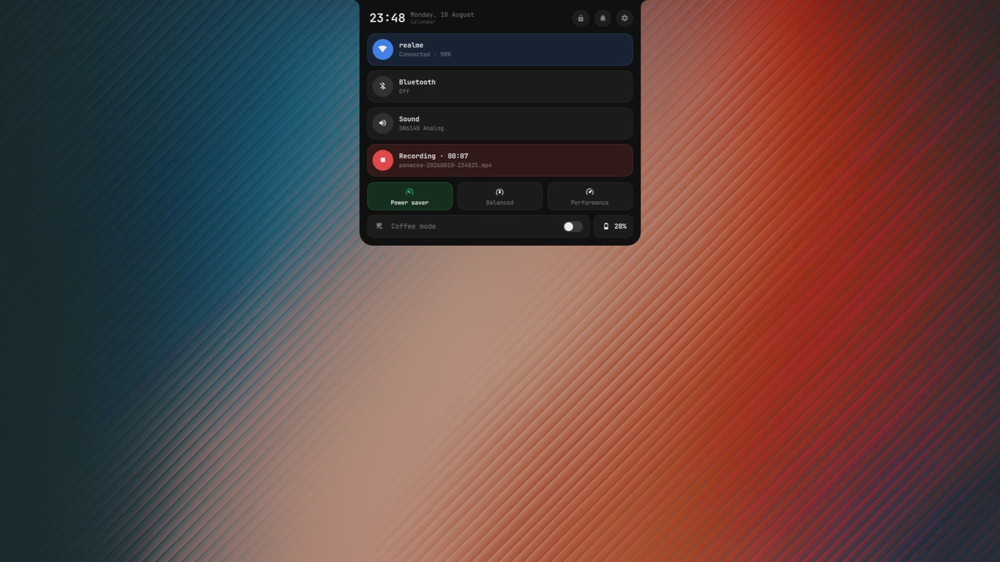

# Panacea

> One pill for everything.

A Hyprland desktop where the whole shell is a single capsule at the top of the
screen. No bar, no tray, no scattered popups — Wi‑Fi, Bluetooth, power profiles,
the launcher, notifications, the media player, a file manager, a password
manager, the power menu and the settings all live inside one pill that morphs
into whatever you asked for and flows back when you're done. It hugs the top
edge with two concave corners, like a hardware notch: no floating rectangle, no
gap, no border — only the content changes.

<sub>Arch Linux · Hyprland · Quickshell · Fish</sub>

## Demo

[](https://github.com/EnsixD/Panacea/raw/main/demo.mp4)

<sub>A ~1-minute silent tour, recorded with the pill's own screen recorder —
click the image to play. <br>
GitHub only plays videos inline when they're uploaded through its editor, not
when they're committed as files: to embed the player, edit this section on
github.com, drag <code>demo.mp4</code> onto this line, and replace the image
link above with the upload URL it generates.</sub>

## Pages

Every panel is the same capsule at a different size, so the whole shell shares
one geometry, one palette and one animation timeline.

| Page | Opens with | What it does |
|---|---|---|
| Quick settings | `Super + Z` | Wi‑Fi, Bluetooth, sound, power profile, recorder, passwords, tray |
| Networks / Bluetooth | `Super + Shift + W` / `+ B` | Scan, connect, pair |
| Notifications | `Super + Shift + N` | Live toasts, history, do‑not‑disturb |
| Themes | `Super + Shift + T` | 15 schemes, each with a wallpaper |
| Player | `Super + M` | Now playing, transport, live equaliser |
| Launcher | `Super + A` | App search + calculator, recents first |
| Clipboard | `Super + V` | `cliphist` history with search |
| Files | `Super + E` | Bookmarks, trash, context menu, drag‑out |
| Media | opens a file | Images, GIFs, video — trim and crop |
| Recorder | `Super + P` | FPS, folder, system audio, microphone |
| Passwords | `Super + Shift + P` | Encrypted vault, browser import, save prompts |
| Power | `Ctrl + Alt + Del` | Sleep, lock, log out, restart, shut down |
| Settings | `Super + I` | Everything above, live preview, rebindable keys |

Hovering the pill opens it too — the player if something is playing, quick
settings otherwise. Every page closes with the same key, `Escape`, or a click
outside. Collapsed, it shows day, clock, workspace, layout and battery.

## What's inside

| | |
|---|---|
| **Compositor** | [Hyprland](https://hyprland.org), Lua config |
| **Shell** | [Quickshell](https://quickshell.org) — the pill, in QML |
| **CLI** | Fish + eza + zoxide |
| **Terminals** | foot, Ghostty, Kitty |
| **Lock / wallpaper** | hyprlock, hyprpaper, hyprsunset |

The pill is also the notification daemon and the polkit agent, so don't run
`mako`, `dunst` or `hyprpolkitagent` alongside it.

## Install these dotfiles

> Back up your own `~/.config` first — this overwrites `hypr` and the terminal
> configs.

```bash
git clone https://github.com/EnsixD/Panacea.git
cd Panacea
./install.sh
```

The script checks and installs the dependencies (repos + AUR for
`quickshell`), backs up anything it would overwrite as `*.bak-<timestamp>`,
copies the configs, enables Bluetooth / power-profiles / iwd, and offers the
SDDM login theme. Flags: `--no-deps`, `--no-sddm`, `--yes`. Prefer to do it by
hand? Copy `panacea hypr foot ghostty kitty fish fastfetch nano` into
`~/.config`, `nano/nanorc` to `~/.nanorc`, `bin/*` to `~/.local/bin`, then
`hyprctl reload`.

Networking assumes **iwd** (the Wi‑Fi page drives `iwctl` directly — no
NetworkManager). Power profiles go through `power-profiles-daemon` over D‑Bus.
Everything resolves `$HOME` at runtime — no hardcoded paths.

Just the pill, without the rest of the dotfiles? See
[**Panacea‑island**](https://github.com/EnsixD/Panacea-island) — a standalone
installer that drops the shell onto your existing Hyprland setup and asks before
touching your keybinds.

## Layout

```
panacea/   the pill: QML, scripts, settings.json
hypr/      Hyprland (Lua config, themes, wallpapers, scripts)
bin/       standalone helper scripts
fish/      shell config and prompt
foot/ ghostty/ kitty/   terminals
fastfetch/ nano/
```

Shortcuts live in `panacea/settings.json` and compile into
`hypr/lua/binds_data.lua` from the settings panel; that generated file is
gitignored, and without it the defaults in `keybindings.lua` apply.

## Licence

MIT.
