# Panacea

> One pill for everything.

A Hyprland desktop where the entire shell is a single capsule at the top of the screen. No bar, no tray, no scattered popups — Wi‑Fi, Bluetooth, power profiles, the app launcher, the clipboard, the media player, the power menu and the settings all live inside the same pill, which morphs into whatever you asked for and flows back when you're done.


<p align="center">
  <sub>Arch Linux · Hyprland · Quickshell · Fish</sub>
</p>

---

## Why

Most rices scatter their UI: a bar here, a launcher there, a notification daemon somewhere else, each with its own look, its own animation curve and its own idea of what a rounded corner is. Panacea collapses all of that into one surface. Every panel is the same capsule at a different size, so the whole shell shares one geometry, one palette and one animation timeline.

It hugs the top edge of the screen with two concave corners, the way a hardware notch does — there is no floating rectangle, no gap, no border. Only the content changes.

## Look

<table>
  <tr>
    <td width="50%">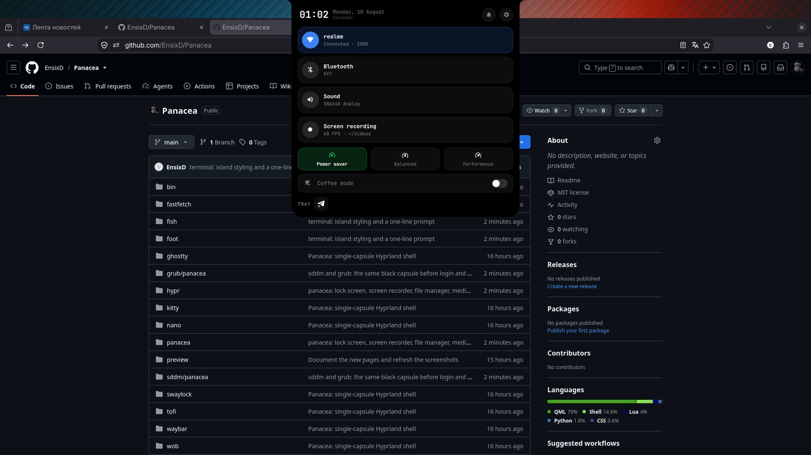</td>
    <td width="50%">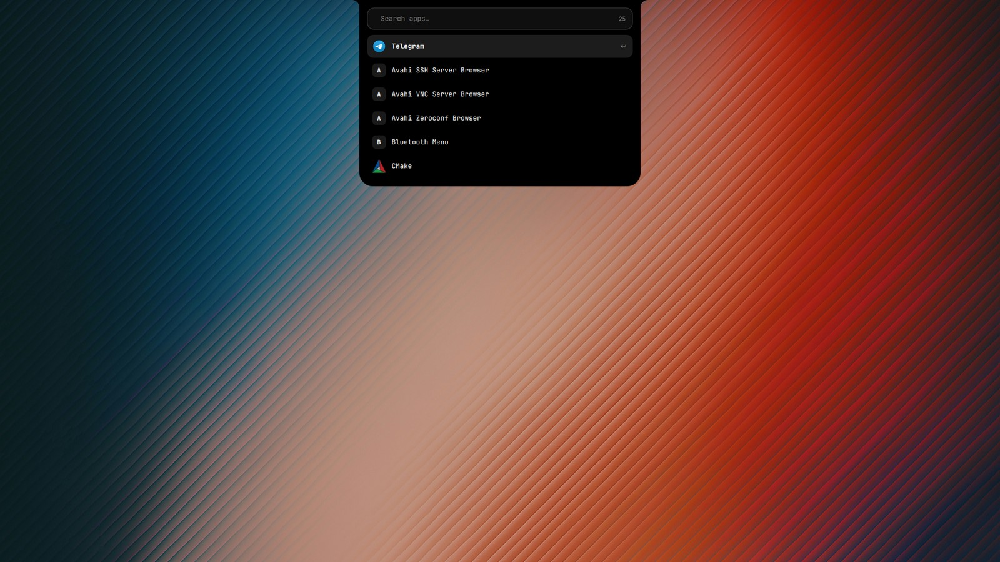</td>
  </tr>
  <tr>
    <td align="center"><b>Quick settings</b><br><sub>Wi‑Fi, Bluetooth and power profiles</sub></td>
    <td align="center"><b>Launcher</b><br><sub>Fuzzy search over desktop entries</sub></td>
  </tr>
</table>

<p align="center">
  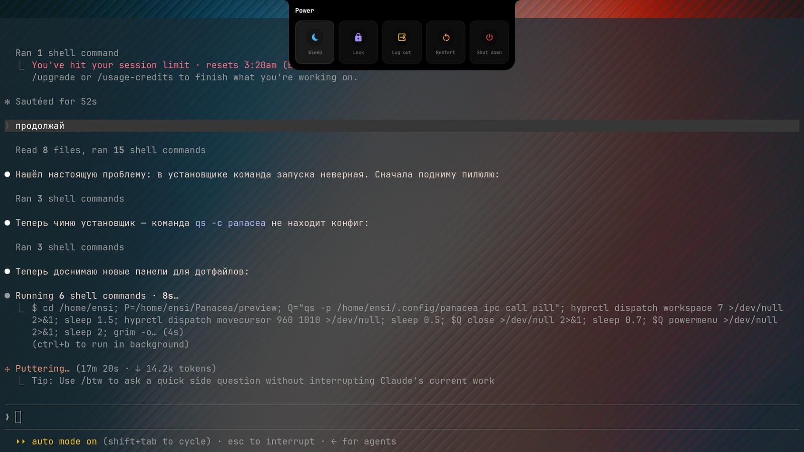
  <br><sub><b>Power menu</b> — press once to arm, again to confirm</sub>
</p>

<table>
  <tr>
    <td width="50%">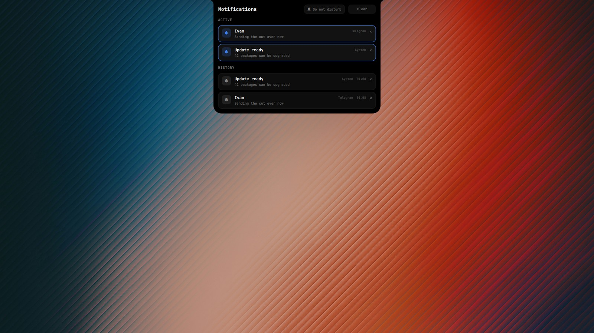</td>
    <td width="50%">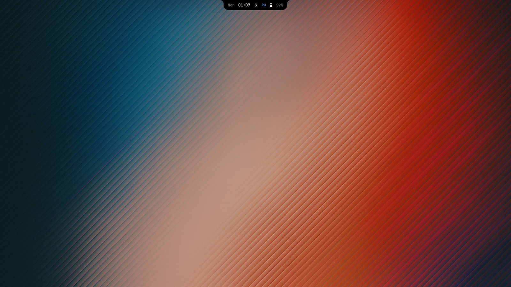</td>
  </tr>
  <tr>
    <td align="center"><b>Notifications</b><br><sub>Live and history, with do-not-disturb</sub></td>
    <td align="center"><b>Calendar</b><br><sub>Opens from the clock in quick settings</sub></td>
  </tr>
  <tr>
    <td>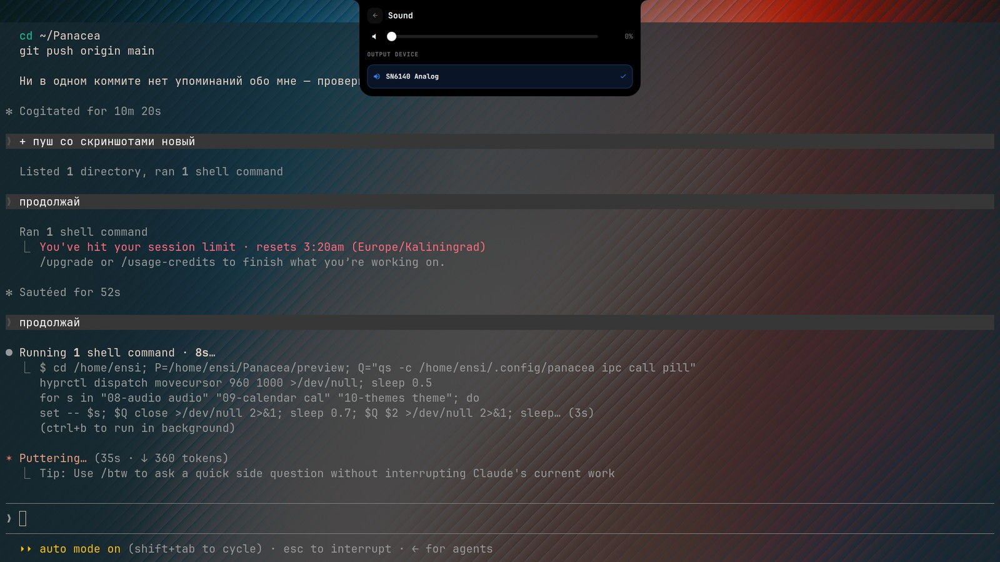</td>
    <td>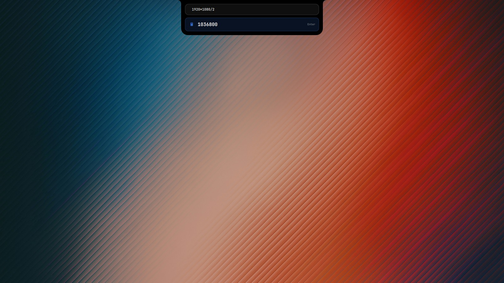</td>
  </tr>
  <tr>
    <td align="center"><b>Sound</b><br><sub>Volume and output device</sub></td>
    <td align="center"><b>Calculator</b><br><sub>Type an expression, Enter copies</sub></td>
  </tr>
</table>

<table>
  <tr>
    <td width="50%">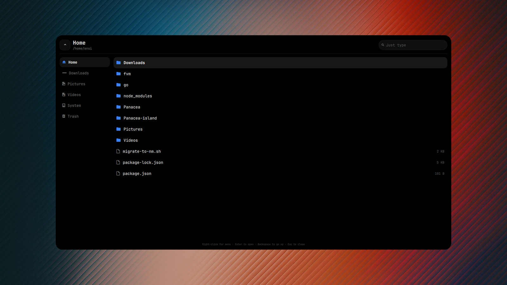</td>
    <td width="50%">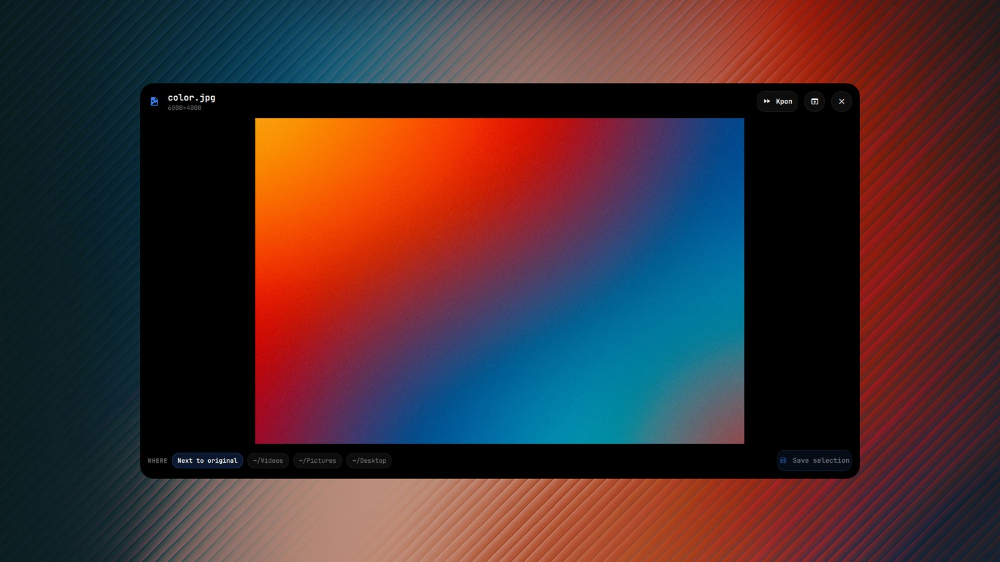</td>
  </tr>
  <tr>
    <td align="center"><b>Files</b><br><sub>Bookmarks, trash, context menu, drag-out</sub></td>
    <td align="center"><b>Media</b><br><sub>Images, GIFs and video with trim and crop</sub></td>
  </tr>
  <tr>
    <td>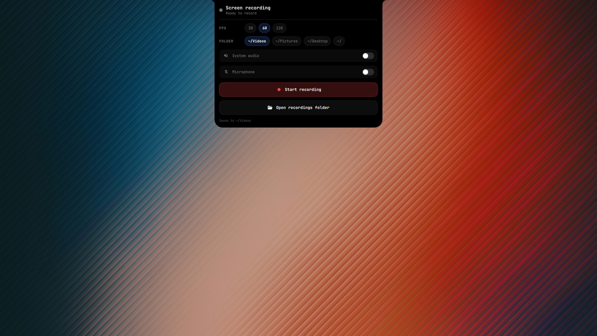</td>
    <td>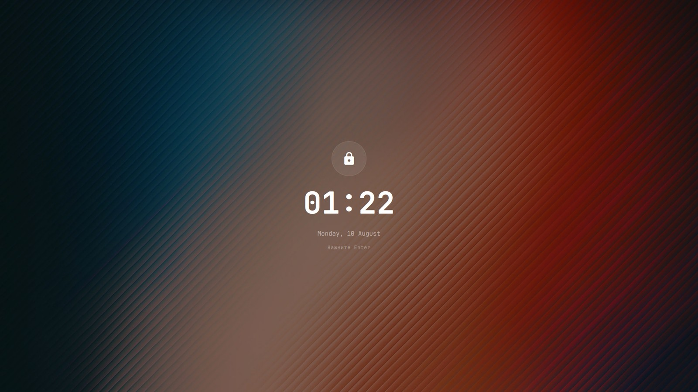</td>
  </tr>
  <tr>
    <td align="center"><b>Recorder</b><br><sub>FPS, folder, system audio and microphone</sub></td>
    <td align="center"><b>Lock screen</b><br><sub>Wallpaper blurs behind the password capsule</sub></td>
  </tr>
</table>

### Themes

Fifteen colour schemes, each with its own wallpaper. Previews are cached
thumbnails, so the grid opens instantly rather than decoding 35MB of JPEG.

<p align="center">
  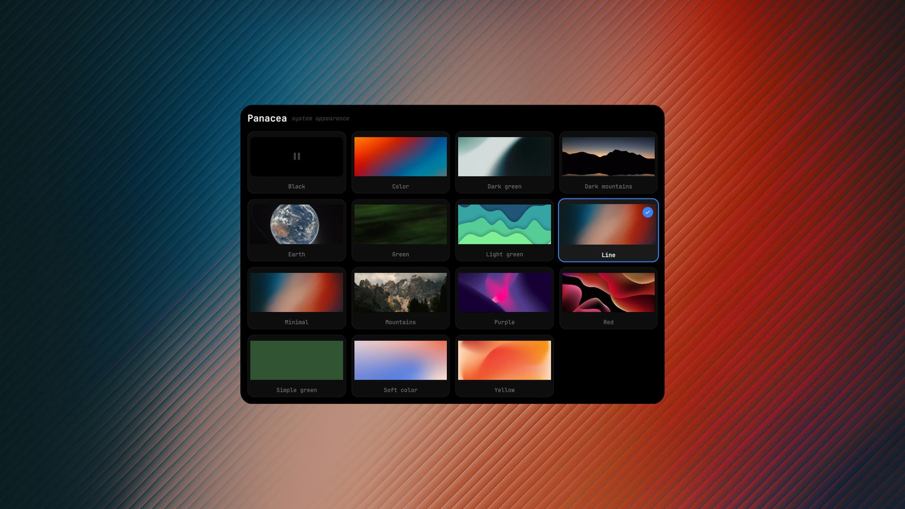
</p>

### Authentication

polkit prompts render as a pill page. There is no separate agent window,
and no second agent running — polkit permits only one.

<p align="center">
  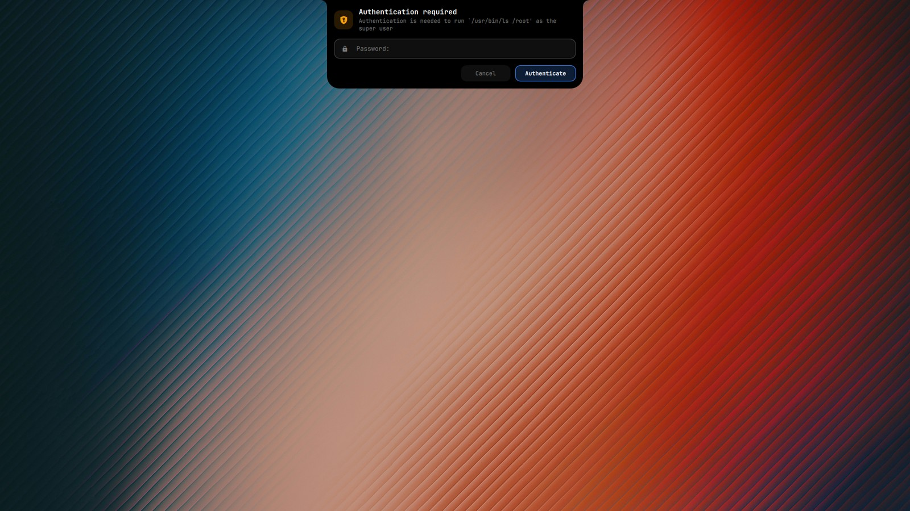
</p>

### Settings, with a live preview

The pill configures itself. Every appearance option is edited in a draft and rendered in a miniature pill above the controls, so you never adjust a slider blind. Nothing touches the real shell until you press **Apply**.

<p align="center">
  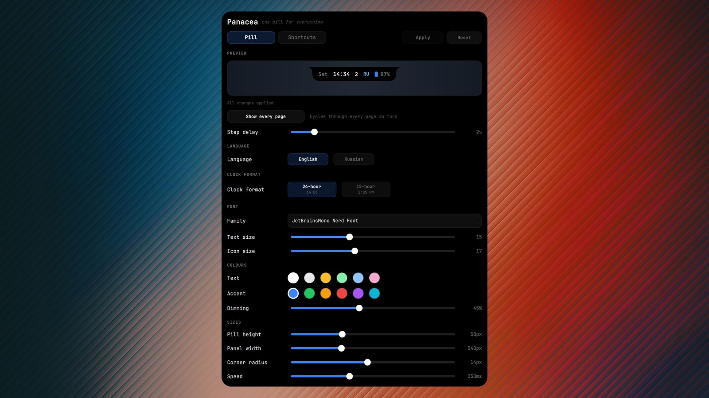
</p>

### Every shortcut, rebindable

The second tab lists every named binding in the system. Click one, press the combination you want — it appears live as you hold the keys — and apply. While capturing, Hyprland is parked in an empty submap so your keypress is recorded instead of firing the action it is currently bound to.

<p align="center">
  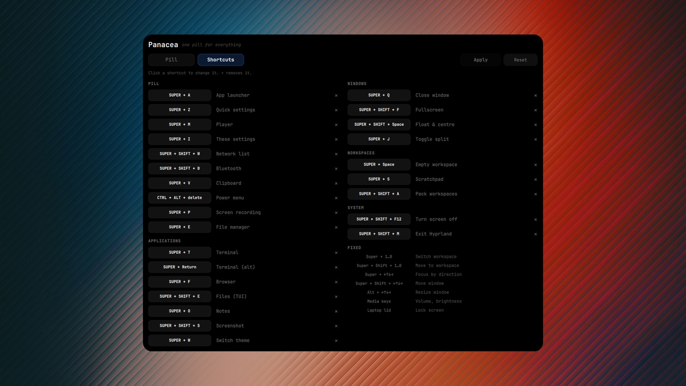
</p>

---

## What's inside

| | |
|---|---|
| **Compositor** | [Hyprland](https://hyprland.org) with a Lua configuration |
| **Shell** | [Quickshell](https://quickshell.org) — the pill, written in QML |
| **Terminals** | foot (server mode), Ghostty, Kitty |
| **Shell (cli)** | Fish, with history autosuggestions |
| **Lock / wallpaper** | hyprlock, hyprpaper, hyprsunset |
| **Themes** | 15 built‑in colour schemes with matching wallpapers |

### Pill pages

| Page | Opens with | What it does |
|---|---|---|
| Quick settings | `Super + Z` | Wi‑Fi, Bluetooth, sound, power profile, tray, coffee mode |
| Networks | `Super + Shift + W` | Scan, connect, enter passwords |
| Bluetooth | `Super + Shift + B` | Pair and connect devices |
| Sound | from quick settings | Volume and output device |
| Notifications | `Super + Shift + N` | Live notifications, history, do‑not‑disturb |
| Calendar | click the clock | Month grid |
| Themes | `Super + W` | Fifteen schemes with wallpaper previews |
| Player | `Super + M` | Now playing, transport, live equaliser |
| Launcher | `Super + A` | Application search, and a calculator |
| Clipboard | `Super + V` | `cliphist` history with search |
| Power | `Ctrl + Alt + Delete` | Sleep, lock, log out, restart, shut down |
| Settings | `Super + I` | Everything above, configurable |
| Authentication | automatic | polkit password prompts |

Hovering the pill opens it too: the player if something is playing, quick settings otherwise. Every page closes with the same key that opened it, or with `Escape`, or by clicking outside.

### Collapsed state

Day, clock, current workspace, keyboard layout and battery. The workspace number and the layout flip over when they change; the battery icon fills by percentage and turns into a lightning bolt while charging.

---

## Design notes

A few decisions that are easy to miss but are the reason it feels the way it does.

**One animation timeline.** The real pill and the panel it expands into are different objects. They cross‑fade with matched durations, and every panel derives its curve from a single `animMs` setting, so nothing ever blinks or races.

**Content resizing is not panel morphing.** Growing a network list and opening a panel are different gestures, so they use different curves — 110 ms for content, 230 ms for the morph. Nesting them (the mistake this config started with) makes the panel feel sluggish.

**Centring uses the target size.** The settings panel detaches from the top edge and centres itself. Its offset is computed from the final height, not the animating one, so it travels in one motion rather than expanding first and sliding second.

**Nerd Font icons are not centred by anchors.** Their ink is wider than the
advance — the gear glyph is 13px wide in a 9.6px cell — and Qt reports both
bounding boxes relative to the baseline, not the item. `Glyph.qml` converts to
local coordinates and centres the ink, which is why icons sit true in their
circles.

**Constant window height.** It used to switch between 560px and the screen
height when a page was pinned, recreating the Wayland layer mid-animation.
Panels are masked instead, so clicks still pass through when nothing is open.

**Gestures are Hyprland's own.** A Lua callback fires once, after the fingers
lift. The built-in trackpad gestures update on every motion event, so a window
follows the swipe and springs back if you change your mind.

**No hardcoded home paths.** Everything resolves `$HOME` at runtime.

---

## Requirements

```
hyprland quickshell fish foot ghostty kitty
hyprpaper hyprlock hyprsunset
brightnessctl playerctl wireplumber cliphist wl-clipboard
grim slurp jq ffmpeg iwd bluez-utils power-profiles-daemon
ttf-jetbrains-mono-nerd papirus-icon-theme
```

Optional: `cava` for a real audio spectrum in the player — a synthetic wave is
drawn without it.

The pill registers as the notification daemon and the polkit agent, so do not
run `mako`, `dunst` or `hyprpolkitagent` alongside it.

Networking assumes **iwd**; the Wi‑Fi page talks to `iwctl` directly and does not need NetworkManager. Power profiles talk to `power-profiles-daemon` over D‑Bus via `busctl`, so a broken `powerprofilesctl` (missing `python-gobject`) does not matter.

## Install

An automated installer is on the way. For now:

```bash
git clone https://github.com/EnsixD/Panacea.git
cd Panacea
cp -r panacea hypr foot ghostty kitty fish fastfetch tofi waybar wob swaylock ~/.config/
cp nano/nanorc ~/.nanorc
cp bin/* ~/.local/bin/ && chmod +x ~/.local/bin/*
```

Then log out and back in, or reload Hyprland.

> Back up your own `~/.config` first — this overwrites `hypr` and the terminal configs.

## Layout

```
panacea/     the pill: QML, helper scripts, settings.json
hypr/        Hyprland (Lua config, themes, wallpapers, scripts)
bin/         standalone helper scripts
fish/        shell configuration and prompt
foot/ ghostty/ kitty/   terminals
tofi/ waybar/ wob/      fallbacks used in battery mode
swaylock/ fastfetch/ nano/
preview/     the screenshots in this file
```

Shortcuts are stored in `panacea/settings.json` and compiled into `hypr/lua/binds_data.lua` by the settings panel. That generated file is gitignored; without it the defaults in `keybindings.lua` apply.

## Licence

MIT.
