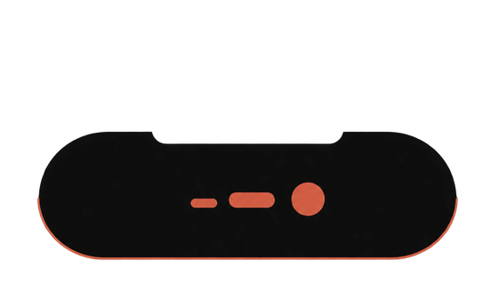

<div align="center">



# Panacea Shell

**One pill for everything.** A Hyprland desktop where the whole shell is a single
capsule at the edge of the screen.

<a href="https://archlinux.org"></a>
<a href="https://hyprland.org"></a>
<a href="https://quickshell.org"></a>
<a href="https://fishshell.com"></a>
<a href="#licence"></a>

</div>

---

No bar, no tray, no scattered popups. Wi‑Fi, Bluetooth, power profiles, the
launcher, notifications, the media player, a file manager, a password manager,
the power menu and the settings all live inside one pill that morphs into
whatever you asked for and flows back when you're done. It hugs its screen edge
with two concave corners, like a hardware notch: no floating rectangle, no gap,
no border — only the content changes.

The island can sit at any edge — top, bottom, left or right — and always opens
towards the centre of the screen. At the side edges it turns vertical and stacks
its text letter under letter, so nothing has to be read with a tilted head.

## Demo


https://github.com/user-attachments/assets/4eaa0e05-9295-472a-943b-70260d7e5961


<sub>A short tour recorded with the pill's own screen recorder. The same clip is
committed as <code>demo.mp4</code>; the link above is GitHub's own upload, since
it only plays videos inline when they come from its editor rather than from a
file in the repository.</sub>

## Pages

Every panel is the same capsule at a different size, so the whole shell shares
one geometry, one palette and one animation timeline.

| Page | Opens with | What it does |
|---|---|---|
| Quick settings | `Super + Z` | Wi‑Fi, Bluetooth, sound, now playing with transport and seeking straight on the equaliser, recorder, battery, passwords, tray |
| Networks / Bluetooth | `Super + Shift + W` / `+ B` | Scan, connect, pair |
| Notifications | `Super + Shift + N` | Live cards that open what they are about, one history list, do‑not‑disturb |
| Wallpapers | `Super + Shift + T` | Full‑screen carousel with parallax previews, stills and live video |
| Workspaces | `Super + Tab` | Live previews of every workspace, switch from the grid |
| Launcher | `Super + A` | App search + calculator, recents first |
| Clipboard | `Super + V` | `cliphist` history with search |
| Files | `Super + E` | Bookmarks, disks, sorting, trash, context menu, drag between windows |
| Media | opens a file | Images, GIFs, video — trim and crop |
| Recorder | `Super + P` | FPS, folder, system audio, microphone |
| Passwords | `Super + Shift + P` | Encrypted vault, browser import, save prompts |
| Battery | from quick settings | Power profiles, charge state, capacity and wear |
| Power | `Ctrl + Alt + Del` | Sleep, lock, log out, restart, shut down |
| Settings | `Super + I` | Pill, system, displays, keys — with live mock‑ups |
| Shortcuts | `Super + /` | Every binding in one place, rebindable |

Hovering the pill opens it too — the player if something is playing, quick
settings otherwise. Every page closes with the same key, `Escape`, or a click
outside. Collapsed, it shows day, clock, workspace, layout and battery.

**Settings** has four sections: the pill (a mock‑up of your desktop with the real
island on it, its screen edge and the colours), the system (language, clock,
file‑manager mode), displays (resolution, refresh rate, scale, orientation, VRR,
multi‑monitor arrangement) and the keys.

## Colours and wallpapers

There is **one palette** for the whole system, in `hypr/palette.conf`.
`hypr/scripts/palette.sh` spreads it across the terminals, waybar, btop, fish,
neovim and the login screen. Changing the wallpaper never touches the colours —
and never touches a file that Hyprland sources, so your windows are left alone.

## What's inside

| | |
|---|---|
| **Compositor** | [Hyprland](https://hyprland.org), Lua config |
| **Shell** | [Quickshell](https://quickshell.org) — the pill, in QML |
| **CLI** | Fish + eza + zoxide |
| **Terminals** | foot, Ghostty, Kitty |
| **Lock / wallpaper** | hyprlock, hyprpaper, hyprsunset |
| **Boot / login** | GRUB theme, SDDM theme — both matching the palette |

The pill is also the notification daemon and the polkit agent, so don't run
`mako`, `dunst` or `hyprpolkitagent` alongside it.

## Install these dotfiles

> [!WARNING]
> **The installer is young.** It has been run on a handful of machines, mostly
> the author's. It backs up everything it replaces as `*.bak-<timestamp>`, but
> mistakes are still possible — back up your own `~/.config` first, and read the
> flags below before running it on a setup you care about.

```bash
git clone https://github.com/EnsixD/Panacea.git
cd Panacea
./install.sh
```

The script checks and installs the dependencies (repos + AUR for `quickshell`),
backs up anything it would overwrite, copies the configs, enables Bluetooth /
power‑profiles / iwd, spreads the palette across the applications, restores the
wallpaper and warms up its thumbnails. It then offers, one prompt at a time: the
wallpaper pack (about 400 MB, downloaded as plain files), the GRUB boot theme and
the SDDM login theme.

Flags: `--no-deps`, `--no-sddm`, `--no-grub`, `--yes`.

Prefer to do it by hand? Copy `panacea hypr foot ghostty kitty fish fastfetch
nano tofi waybar` into `~/.config`, `nano/nanorc` to `~/.nanorc`, `bin/*` to
`~/.local/bin`, then run `hypr/scripts/palette.sh`, `hypr/scripts/switch_theme.sh
--restore` and `hyprctl reload`.

Networking assumes **iwd** (the Wi‑Fi page drives `iwctl` directly — no
NetworkManager). Power profiles go through `power-profiles-daemon` over D‑Bus.
Everything resolves `$HOME` at runtime — no hardcoded paths.

## Layout

```
panacea/   the pill: QML, scripts, settings.json
hypr/      Hyprland (Lua config, palette, wallpapers, scripts)
grub/      boot theme + the script that generates its assets
sddm/      login theme
bin/       standalone helper scripts
fish/      shell config and prompt
foot/ ghostty/ kitty/   terminals
fastfetch/ nano/ tofi/ waybar/
```

Shortcuts live in `panacea/settings.json` and compile into
`hypr/lua/binds_data.lua` from the settings panel; that generated file is
gitignored, and without it the defaults in `keybindings.lua` apply.

## Credits

None of the wallpapers here are mine. They are kept for convenience, and every
one of them belongs to its original author.

**Bundled wallpapers**

- `ember_stripes.jpg` (was `line.jpg`) and `misty_peaks.jpg` (was
  `mountains.jpg`) — from
  [matteogini/dotfiles](https://github.com/matteogini/dotfiles), the `hyprland`
  branch, `hypr/wallpaper/` — the rice this setup grew out of.
- `spring_bloom.jpg` — from the **Graphite Mono** theme of
  [HyDE](https://github.com/HyDE-Project/HyDE). It lives in
  `wallpaper/custom/` rather than in the repository, and the palette in
  `hypr/palette.conf` is derived from it.

Wallpapers are named after what they show, so the carousel reads as a list of
pictures rather than a list of file ids.

They are kept here only so a fresh install has something to show. If you are the
author of an image and want it gone, open an issue and it will be removed.

**Wallpaper pack** (optional, fetched by the installer, not redistributed here)

- [ilyamiro/shell-wallpapers](https://github.com/ilyamiro/shell-wallpapers) —
  the collection the installer offers to download into
  `~/.config/hypr/wallpaper/shell`. Individual images belong to their own
  authors; the collection only gathers them.

**Live wallpapers**

Video wallpapers play through [mpvpaper](https://github.com/GhostNaN/mpvpaper),
which puts mpv on the background layer; hyprpaper steps aside while a video is
up. Drop `.mp4`, `.webm`, `.mkv` or `.mov` files into
`~/.config/hypr/wallpaper/live` — the **Live wallpapers** tab of the carousel has
a button that opens that folder in the file manager. Posters are pulled from the
middle of each clip. One mpv runs per monitor and each pauses on its own when its
wallpaper is covered, so a fullscreen window on one screen does not freeze the
others.

Nothing is bundled — bring your own, or take them from here:

- [DesktopHut](https://www.desktophut.com) — large library of ready‑made MP4
  loops, including very minimal abstractions.
- [Wallper](https://wallper.app) ([source](https://github.com/alxndlk/wallper-app))
  — open collection of 4K/60 H.264/H.265 loops with a community library.
- [TuxPapers](https://tuxpapers.com) — animated wallpapers aimed at
  Linux/Hyprland/Sway, with per‑monitor setup.
- [Papyrus](https://github.com/PSGtatitos/papyrus) — animated wallpaper manager:
  point it at a folder of MP4/WebM/MKV files and get a library with previews.

Each of these has its own terms. Check them before redistributing anything you
download.

**Logo**

`assets/logo*.png` — drawn for this project; the capsule with two concave notch
cutouts is the shell's own silhouette. Same licence as the code.

**Fonts and icons**

- [JetBrains Mono Nerd Font](https://www.nerdfonts.com) — the whole interface,
  SIL Open Font License.
- [Material Design Icons](https://pictogrammers.com/library/mdi/), shipped
  inside the Nerd Font — every glyph in the pill.

**Tools this leans on**

[Hyprland](https://hyprland.org) · [Quickshell](https://quickshell.org) ·
[cava](https://github.com/karlstav/cava) · [cliphist](https://github.com/sentriz/cliphist) ·
[hyprpaper / hyprlock / hyprsunset](https://github.com/hyprwm) ·
[wf-recorder](https://github.com/ammen99/wf-recorder) · [fish](https://fishshell.com)

## Licence

MIT — see [LICENSE](LICENSE). It covers the configs, the QML and the scripts.
Wallpapers, fonts and anything else bundled from elsewhere keep the terms of
their own authors.
